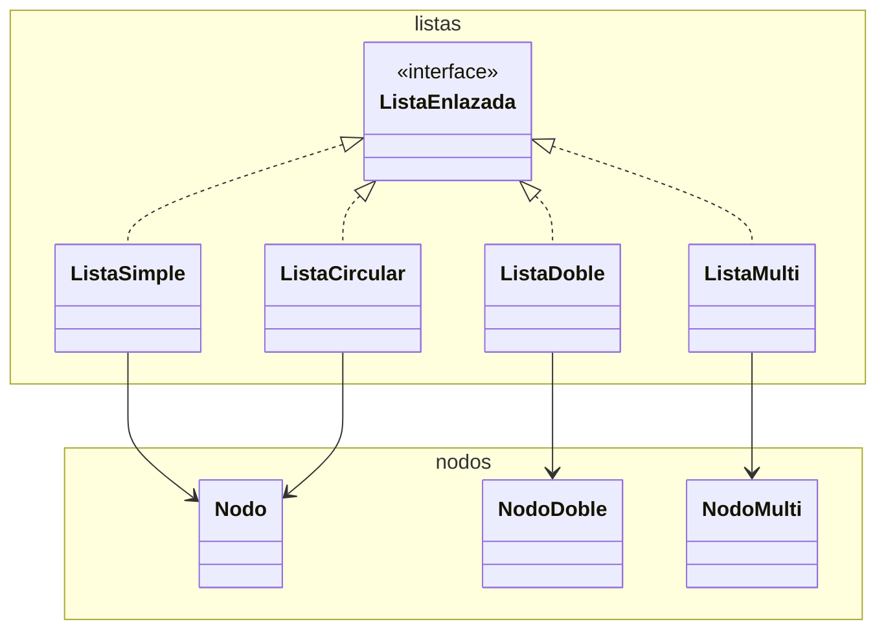

# Diagrama de Clases - Listas Enlazadas

*(Placeholder para el diagrama de clases del paquete `src`)*

```mermaid
classDiagram
    direction TB

    namespace nodos {
        class Nodo {
        }
        class NodoDoble {
        }
        class NodoMulti {
        }
    }

    namespace listas {
        class ListaEnlazada {
            <<interface>>
        }
        class ListaSimple {
        }
        class ListaDoble {
        }
        class ListaCircular {
        }
        class ListaMulti {
        }
    }

    ListaEnlazada <|.. ListaSimple
    ListaEnlazada <|.. ListaDoble
    ListaEnlazada <|.. ListaCircular
    ListaEnlazada <|.. ListaMulti

    ListaSimple --> Nodo
    ListaDoble --> NodoDoble
    ListaCircular --> Nodo
    ListaMulti --> NodoMulti
```
