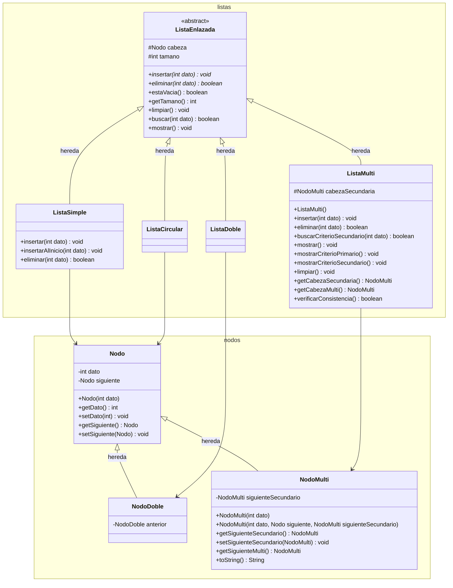

# Diagrama de Clases - Listas Enlazadas

Diagrama de clases UML del módulo `src` para las listas enlazadas y sus respectivos nodos.

```mermaid
classDiagram
    direction TB

    namespace nodos {
        class Nodo {
            -int dato
            -Nodo siguiente
            +Nodo(int dato)
            +getDato() int
            +setDato(int) void
            +getSiguiente() Nodo
            +setSiguiente(Nodo) void
        }
        class NodoDoble {
            -NodoDoble anterior
        }
        class NodoMulti {
            -NodoMulti siguienteSecundario
            +NodoMulti(int dato)
            +NodoMulti(int dato, Nodo siguiente, NodoMulti siguienteSecundario)
            +getSiguienteSecundario() NodoMulti
            +setSiguienteSecundario(NodoMulti) void
            +getSiguienteMulti() NodoMulti
            +toString() String
        }
    }

    namespace listas {
        class ListaEnlazada {
            <<abstract>>
            #Nodo cabeza
            #int tamano
            +insertar(int dato)* void
            +eliminar(int dato)* boolean
            +estaVacia() boolean
            +getTamano() int
            +limpiar() void
            +buscar(int dato) boolean
            +mostrar() void
        }
        class ListaSimple {
            +insertar(int dato) void
            +insertarAlInicio(int dato) void
            +eliminar(int dato) boolean
        }
        class ListaDoble {
        }
        class ListaCircular {
        }
        class ListaMulti {
            #NodoMulti cabezaSecundaria
            +ListaMulti()
            +insertar(int dato) void
            +eliminar(int dato) boolean
            +buscarCriterioSecundario(int dato) boolean
            +mostrar() void
            +mostrarCriterioPrimario() void
            +mostrarCriterioSecundario() void
            +limpiar() void
            +getCabezaSecundaria() NodoMulti
            +getCabezaMulti() NodoMulti
            +verificarConsistencia() boolean
        }
    }

    Nodo <|-- NodoDoble : hereda
    Nodo <|-- NodoMulti : hereda

    ListaEnlazada <|-- ListaSimple : hereda
    ListaEnlazada <|-- ListaDoble : hereda
    ListaEnlazada <|-- ListaCircular : hereda
    ListaEnlazada <|-- ListaMulti : hereda

    ListaSimple --> Nodo
    ListaDoble --> NodoDoble
    ListaCircular --> Nodo
    ListaMulti --> NodoMulti
```
